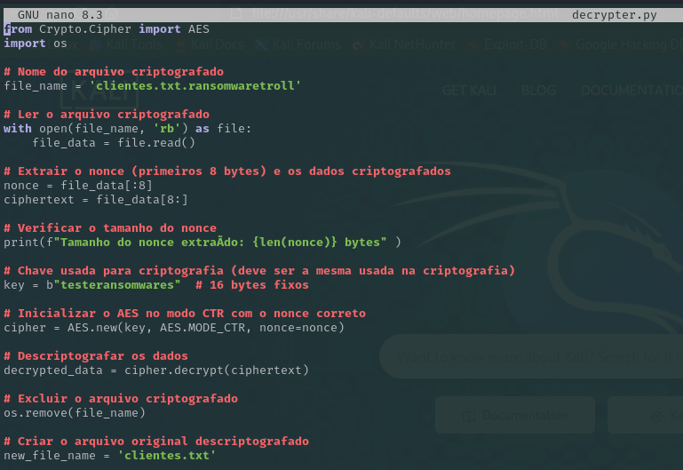

# Ransomware-com-Python
## Para esse projeto vamos usar o seguinte cenário:
-  Máquina virtual com Win-10
-  Máquina virtual com Kali Linux
## Objetivo
-  Criar um programa que criptografe os arquivos de uma detarminada pasta no sistema Win-10
-  Criar um programa que descriptografe os arquivos que foram criptografados no sistema Win-10
-  Usando tecnica de phishin o alvo é motivado a baixar arquivo malicioso de página  fake
-  Alvo executa o Ransomware
-  Arquivo de descriptografia é enviado via e-mail fake
-  Execução do arquivo para descriptografar
## Preparando o Ambiente:
-  Kali Linux
  
- Máquina Alvo
 
- Pasta onde está o aquivo que vai ser criptografado

-  Criando o Ransomware em Python que vai Criptografar

-  Criando o arquivo em Python que vai Descriptografar

-  Enviando o Ransomware usando tecnica de Phishing se passando por e-mail de colaborador

-  Arquivo malicioso plantado

-  Arquivo com o título "clientes" é o alvo que será criptografado

-  Conteúdo do arquivo "clientes" antes de ser criptografado

-  Arquivo "clientes" criptografado

-  Conteúdo Arquivo "clientes" criptografado

-  Chave de descriptografia do conteúdo e Arquivo "clientes" depois de descriptografado
-  

-  Para que sejá possível a execução do código a máquina alvo precisa tem python instalado. Podemos usar outra ferramente e converter para um arquivo executável e macarar em arquivo excel, pdf etc. Para obter êxito é preciso conquistar a confiança do alvo tornando e aproximar o ataque mais próximo da realidade.
  

